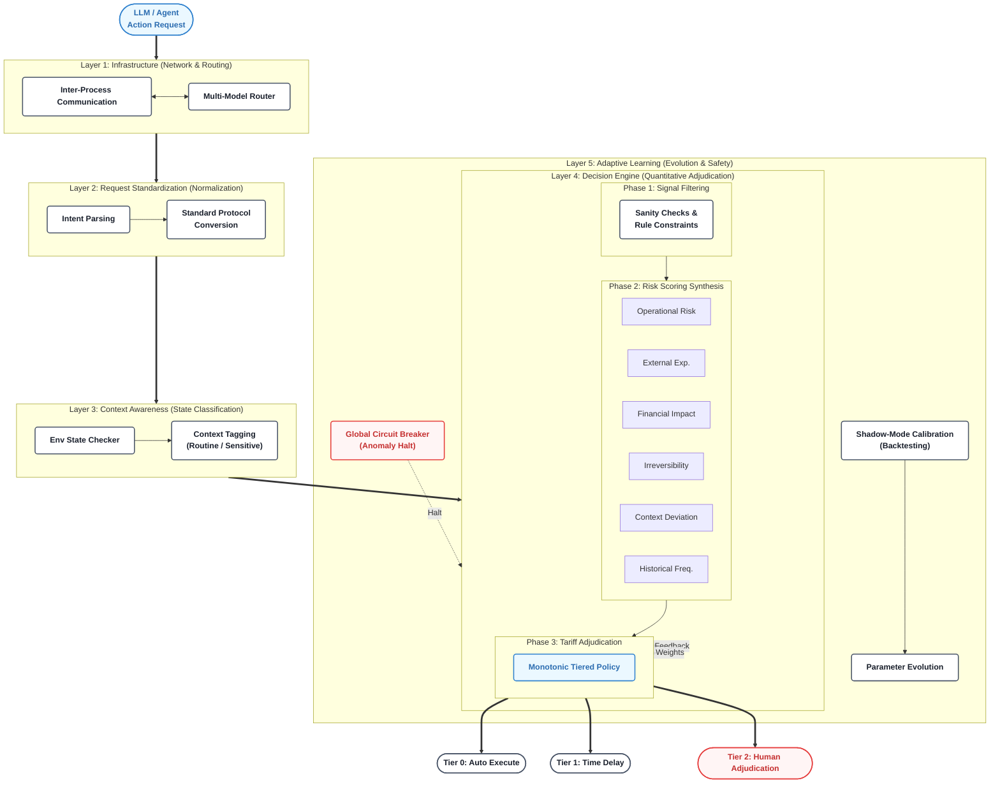

# 🦊 Ninetails Engine (Little Fox)
**Adaptive Behavioral Governance for AI Agents**

[](https://ssrn.com/abstract=6453579) 
[](#) 
[](#)

> A quantitative risk scoring framework derived from quantitative trading risk management (decision tree pruning), designed to solve the safety-utility dilemma in LLM-powered autonomous agents.

## 📌 Overview

Current AI agent frameworks typically handle risk through "Capability Restriction" (an embargo paradigm)—treating safety as a binary classification problem where tools are either fully available or completely disabled. 

**Ninetails Engine (Little Fox)** reframes agent governance through a **"Tariff" paradigm**. Instead of blanket prohibitions, every action is subject to a continuous, quantitative risk assessment that determines the appropriate level of human oversight. By separating the stochastic LLM inference from a deterministic rule engine, this framework eliminates judgment drift and prompt-injection vulnerabilities in the governance pathway.

## ✨ Core Innovations

* **Tariffs, Not Embargo:** Replaces static permissioning with monotonic tiered execution policies (from autonomous execution to multi-step critical delays).
* **Deterministic Adjudication:** The decision engine operates independently from the governed LLM, ensuring safety mechanisms do not degrade during complex reasoning chains.
* **6-Dimensional Risk Scoring:** Evaluates every action across Operation Risk, External Exposure, Financial Impact, Irreversibility, Context Deviation, and Historical Frequency.
* **Shadow-Mode Calibration:** Adapts the "backtest-before-live" principle from quantitative finance, allowing data-driven threshold correction prior to live enforcement.

## 🏗️ Architecture

The framework is built on a 5-layer architecture, mapping directly to quantitative trading counterparts:
1.  **L1 - Infrastructure:** Inter-process communication and multi-model routing.
2.  **L2 - Request Standardization:** Intent normalization.
3.  **L3 - Context Awareness:** Environmental state classification (Routine vs. Sensitive).
4.  **L4 - Decision Engine:** The core 3-layer scoring pipeline (Signal filtering, Synthesis, Adjudication).
5.  **L5 - Adaptive Learning:** Feedback-driven parameter evolution and global circuit breakers.



## 🚀 Status & Roadmap

**Current Status: Pre-Release / Paper Published**

The theoretical foundation and empirical analysis of this framework have been published as a pre-print on SSRN:
🔗 *[https://ssrn.com/abstract=6453579](https://ssrn.com/abstract=6453579)*

*Companion Paper: [Frontiers of Neuro-symbolic Fusion in Quantitative Finance](https://ssrn.com/abstract=6118946)*

**Next Steps:**
We are currently cleaning up the configuration files and performing a final security review. A **minimal reproducible open-source profile**, including the core 3-layer decision engine and the fixed-weight 6-dimensional scoring model, will be released in this repository shortly. 

Please `Watch` and `Star` this repository to be notified of the code release.

## 📝 Citation

If you find this framework useful for your research, please cite our paper:

```bibtex
@article{sun2026adaptive,
  title={Adaptive Behavioral Governance for AI Agents: A Quantitative Risk Scoring Framework Derived from Trading Decision Tree Pruning},
  author={Sun, Hua},
  journal={SSRN Electronic Journal},
  year={2026},
  month={March}
}
```

## 📬 Contact

**Howard Sun**
Independent Researcher
📧 howardsun199@gmail.com
